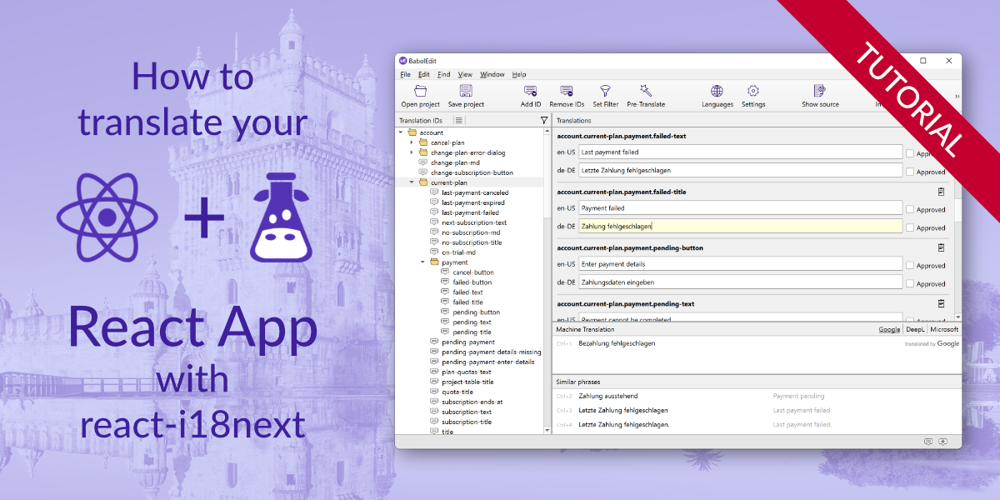

# React + react-i18next example project

This is a simple demo project for our tutorial: [How to translate your React app with react-i18next](https://www.codeandweb.com/babeledit/tutorials/how-to-translate-your-react-app-with-react-i18next).

